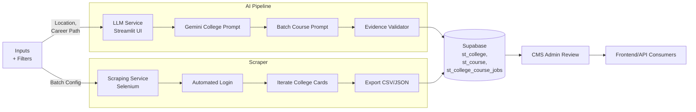

# Disha Backend Architecture Guide

This document orients new contributors to the two Python services that power Disha's data pipeline: the AI-assisted **LLM Service** and the browser automation **Scraping Service**. Together they discover Indian colleges and courses, validate the findings, and publish staged data for the CMS/frontend stack.

## Quick Map

| Service | Location | Entrypoint | Primary Role |
| --- | --- | --- | --- |
| LLM Service | `backend/llm-service/` | `app.py` (Streamlit) | Uses Google Gemini to discover colleges/courses, validates evidence, and pushes curated data to Supabase staging tables. |
| Scraping Service | `backend/scraping-service/` | `main.py`, `batch_runner.py` | Automates CareerZoom searches via Selenium to bulk download structured college/course data when deterministic scraping is preferred. |

Support folders:

- `backend/llm-service/engines/` – pluggable components for LLM prompting, validation, and Supabase integration.
- `backend/llm-service/models/` – dataclasses describing the canonical `College` and `Course` objects used across the pipeline.
- `backend/scraping-service/src/` – Selenium helpers for authentication, navigation, extraction, and export utilities.

## End-to-End Flow

1. **Input capture** – an operator supplies a target location (and optional career path) through the Streamlit UI, or prepares scraping filters/batch tasks.
2. **Discovery**
   - *LLM path*: Gemini is prompted in two stages (college list → batched course enrichment) to minimize API calls.
   - *Scraping path*: Selenium scrolls the CareerZoom UI, iterates each college card, and enumerates the dropdown of courses.
3. **Validation** (LLM path) – websites are fetched, keywords scanned, government portals probed, and course evidence links collected to adjust confidence scores.
4. **Staging** – deduplicated colleges/courses are upserted into Supabase `st_college`, `st_course`, and `st_college_course_jobs` tables with confidence metadata.
5. **Review & publish** – CMS admins review staged entries, associate jobs, then promote to production. Frontend queries the promoted data.



## LLM Service (AI Discovery + Validation)

### LLM Responsibilities

- Generate comprehensive college lists per location (`CollegeDiscoveryEngine.create_college_list_prompt`).
- Batch course discovery to cut Gemini token costs (`_discover_batch_courses`).
- Validate evidence by crawling official sites and heuristics (`EvidenceValidator`).
- Push curated data with confidence tiers to Supabase staging tables (`SupabaseIntegration`).

### LLM Key Modules

- `app.py` – Streamlit workflow coordinating prompts, batching, validation, and exports.
- `engines/llm_engine.py` – Prompt engineering, Gemini calls, JSON repair, and object parsing.
- `engines/validation_engine.py` – Async validators that score websites, course evidence, and govt recognition.
- `engines/supabase_integration.py` – Inserts/deduplicates colleges/courses and links them in staging tables.
- `models/college.py` – `College`/`Course` dataclasses plus enums for verification states; shared across services.

### LLM Runtime Steps

1. Configure keys in `.env` (`GOOGLE_API_KEY`, `SUPABASE_URL`, `SUPABASE_KEY`).
2. Install dependencies: `pip install -r backend/llm-service/requirements.txt`.
3. Launch Streamlit UI from the service root:

    ```bash
    cd backend/llm-service
    streamlit run app.py
    ```

4. Use the sidebar to supply API creds, tweak batch size/validation delay, and (optionally) regenerate the college/course prompts.
5. Run the pipeline to inspect results, download CSV/JSON, or push directly to Supabase staging tables with live progress metrics.

### Confidence & Evidence Model

- **Confidence score (0–1)** starts with Gemini’s signal and is adjusted by validation weights (website reachability ±0.1, course evidence ±0.2, govt verification +0.2, domain type ±0.1).
- **Evidence status**: `VERIFIED`, `PARTIALLY_VERIFIED`, `NO_EVIDENCE_FOUND`, `PENDING_VERIFICATION` – used to triage admin review.
- **Supabase staging schema**: `st_college` stores metadata & evidence, `st_course` deduplicates course names, `st_college_course_jobs` links colleges to courses (jobs assigned later in CMS).

## Scraping Service (Deterministic Harvesting)

### Scraper Responsibilities

- Log into CareerZoom with Selenium (automatic or manual fallback) and persist a browser session for multiple tasks.
- Apply filters (course category, specialization, city, university) by constructing encoded search URLs (`build_search_url`).
- Scroll and paginate through college cards, capturing both institution metadata and every dropdown course variant.
- Export deduplicated results to CSV/JSON and emit batch execution summaries.

### Scraper Key Modules

- `src/auth.py` – ChromeDriver setup, resilient login (iframe aware) plus manual login helper.
- `src/downloader.py` – Scrolling, card parsing, dropdown iteration, and report-button download attempts.
- `src/utils.py` – Deduplication, export helpers, and shared text normalization.
- `main.py` – Single-task runner with CLI flags for filters, output format, headless/manual modes.
- `batch_runner.py` & `batch_config.py` – Batch orchestration with per-task summaries and optional CSV-configured task lists.

### Scraper Runtime Steps

1. Install dependencies: `pip install -r backend/scraping-service/requirements.txt` (run inside a virtualenv if desired).
2. Update credentials/URLs in `src/config.py` (placeholders exist but should be rotated for security).
3. **Single Task** example:

    ```bash
    cd backend/scraping-service
    python main.py Engineering null Bangalore null --format both --headless
    ```

4. **Batch Mode** using predefined tasks:

    ```bash
    cd backend/scraping-service
    python batch_runner.py --manual-login
    ```

5. Outputs land under `backend/scraping-service/data/` (JSON/CSV plus `batch_summary_*.txt`). Deduplication ensures unique colleges per file.

### Operational Tips

- Keep `BATCH_DELAY` ≥5s to avoid throttling and let CareerZoom finish rendering heavy lists.
- Use manual login when CAPTCHA or MFA challenges appear.
- When dropdown parsing fails (site changes), inspect the selectors in `src/downloader.py` before rerunning large batches.

## Shared Models & Data Contracts

- **College dataclass** includes descriptive fields, contact data, ratings, scholarship notes, confidence metadata, evidence tracking, and a `courses: List[Course]` aggregation.
- **Course dataclass** captures description, duration, degree level, seats, annual fees, exams, specializations, and evidence URLs for review.
- Both services should keep these models in sync; update `models/college.py` first, then adjust each producer (LLM prompts, scraping exports) and the Supabase schema accordingly.

## Onboarding Checklist

- [ ] Install Python 3.9+ and create isolated environments per service.
- [ ] Obtain Google Gemini + Supabase credentials and populate `.env` (LLM service).
- [ ] Confirm Supabase staging tables (`st_college`, `st_course`, `st_college_course_jobs`) exist.
- [ ] Validate Chrome/ChromeDriver compatibility for Selenium (Scraping service) and set `HEADLESS` to match your environment.
- [ ] Run a small LLM discovery job and a single scraping task to understand both data sources.
- [ ] Align downstream consumers (CMS, frontend) on which staging columns are treated as source of truth before promoting data.

With these two services and the staging workflow understood, new backend contributors can confidently iterate on data quality, integrate additional providers, or extend the validation/scraping logic without disrupting the frontend experience.
