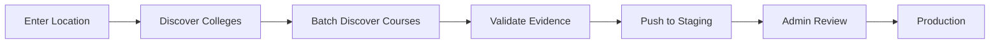

# College and Course discovery LLM service

[](https://streamlit.io/)
[](https://www.python.org/)
[](https://ai.google.dev/)
[](https://supabase.com/)

An AI Pipeline that automatically discovers colleges and their courses from specified locations in India using Google's Gemini AI, validates the data against official sources, and pushes verified data to Supabase staging tables for admin review.

---

## Features

- **AI-Powered Discovery**: Uses Google Gemini to discover colleges and courses
- **Batch Processing**: Optimized API calls (processes 5+ colleges per request)
- **Evidence Validation**: Validates colleges against websites and government databases
- **Staging Pipeline**: Pushes data to staging tables for admin review before production
- **Multi-Level Confidence Scoring**: Assigns confidence scores based on data quality
- **Export Options**: Download results as JSON or CSV
- **Interactive UI**: User-friendly Streamlit interface with real-time progress tracking

---

## Architecture

### Workflow



1. **Discover Colleges** → Find all colleges in a location
2. **Batch Discover Courses** → Extract courses for multiple colleges efficiently
3. **Validate Evidence** → Verify against websites and government portals
4. **Push to Staging** → Insert into Supabase staging tables
5. **Admin Review** → CMS admin reviews and approves for production

### Database Schema (Supabase)

- `st_college` - Staging table for colleges
- `st_course` - Staging table for courses (deduplicated)
- `st_college_course_jobs` - Many-to-many relationships

---

## Installation & Setup

### Prerequisites

- Python 3.8 or higher
- Google API Key (Gemini)
- Supabase account and credentials

### 1. Clone the Repository

```bash
git clone https://github.com/devpifinity/Disha.git
cd Disha
```

### 2. Install Dependencies

```bash
pip install -r requirements.txt
```

### 3. Environment Configuration

Create a `.env` file in the project root:

```env
# Google Gemini API
GOOGLE_API_KEY=your_google_api_key_here

# Supabase Configuration
SUPABASE_URL=https://your-project.supabase.co
SUPABASE_KEY=your_supabase_anon_or_service_key
```

**Get API Keys:**
- **Google API Key**: https://makersuite.google.com/app/apikey
- **Supabase Credentials**: https://app.supabase.com → Project Settings → API

### 4. Project Structure

```
college-discovery-app/
├── app.py                          # Main Streamlit application
├── requirements.txt                # Python dependencies
├── .env                           # Environment variables (DO NOT COMMIT)
├── models/
│   └── college.py                 # Data models (College, Course)
└── engines/
    ├── llm_engine.py              # Gemini AI integration
    ├── validation_engine.py       # Evidence validation
    └── supabase_integration.py    # Database operations
```

---

## Running Locally

### Start the Application

```bash
streamlit run app.py
```

The application will open in your default browser at `http://localhost:8501`

### Using the Application

#### Step 1: Configure Settings (Sidebar)

1. **Gemini Configuration**
   - Enter your Google API Key
   - Select model (default: `gemini-2.0-flash-exp`)

2. **Supabase Configuration**
   - Enter Supabase URL and Key
   - Test connection to verify credentials
   - Check staging stats to see current data

3. **Batch Processing**
   - Adjust batch size (3-15 colleges per batch)
   - Higher batch size = fewer API calls = lower costs

4. **Validation Settings**
   - Enable/disable evidence validation
   - Adjust validation delay (0.5-5 seconds)

#### Step 2: Discover Colleges

1. **Enter Location**: e.g., "Bangalore, Karnataka"
2. **Career Path** (Optional): e.g., "Data Science" (filters courses)
3. Click **"Generate Prompts"** to preview/edit AI prompts
4. Click **"Run Discovery"** to start the process

**What Happens:**
- Step 1: Discovers 40-60 colleges in the location
- Step 2: Batch discovers courses for all colleges
- Step 3: Validates evidence (if enabled)

#### Step 3: Review Results

- View discovery statistics (colleges, courses, confidence scores)
- Preview first 10 colleges with detailed information
- Download complete data as JSON or CSV

#### Step 4: Push to Staging

1. Review the data to be pushed
2. Click **"Push to Staging Tables"**
3. Monitor progress and view push statistics

---

## Deployment on Streamlit Cloud

### Deploy from GitHub (Recommended)

#### Deploy on Streamlit Cloud

1. Go to https://share.streamlit.io/
2. Sign in with GitHub
3. Click **"New app"**
4. Select your repository and branch
5. Set main file path: `app.py`
6. Click **"Advanced settings"**
7. Add secrets (GOOGLE_API_KEY, SUPABASE_URL, SUPABASE_KEY)
8. Click **"Deploy"**
   
---

## Configuration Options

### Batch Size Optimization

| Batch Size | API Calls (60 colleges) | Savings | Recommended For |
|-----------|-------------------------|---------|-----------------|
| 3 | ~20 calls | 67% | High accuracy, slow |
| 5 | ~12 calls | 80% | **Balanced (recommended)** |
| 10 | ~6 calls | 90% | Fast, bulk processing |
| 15 | ~4 calls | 93% | Maximum efficiency |

### Validation Settings

- **Enable Validation**: More accurate but slower (recommended for production)
- **Disable Validation**: Faster discovery (good for testing)
- **Validation Delay**: Prevent rate limiting (1.5s recommended)

---

## Understanding Confidence Scores

### Confidence Levels

| Level | Score Range | Meaning | Action |
|-------|------------|---------|--------|
| **HIGH** | 0.8 - 1.0 | Verified, high-quality data | Auto-approve |
| **MEDIUM** | 0.6 - 0.79 | Good data, minor gaps | Standard review |
| **LOW** | 0.4 - 0.59 | Some concerns | Detailed review |
| **VERY_LOW** | 0.0 - 0.39 | Questionable data | Reject/investigate |

### Confidence Calculation

**Base Score** (from LLM): 0.0 - 1.0

**Adjustments:**
- **+ 0.1**: Website accessible
- **+ 0.1-0.2**: Course evidence found
- **+ 0.2**: Government verified
- **+ 0.1**: Educational domain (.edu.in, .ac.in)
- **- 0.15**: Website inaccessible
- **- 0.1**: No course evidence

### Evidence Status

- `VERIFIED`: Website accessible + courses found + govt verified
- `PARTIALLY_VERIFIED`: Some evidence available
- `NO_EVIDENCE_FOUND`: Unable to validate
- `PENDING_VERIFICATION`: Not yet validated

---

## Troubleshooting

### Common Issues

<details>
<summary><b>1. "No valid JSON found in response"</b></summary> <br/>

**Cause**: Gemini returned invalid JSON

**Solution**: 
- Try running discovery again
- Reduce batch size
</details>

<details>
<summary><b>2. "Supabase connection failed"</b></summary> <br/>

**Cause**: Invalid credentials or network issue

**Solution**:
- Verify URL and Key in sidebar
- Click "Test Connection" to diagnose
- Check Supabase project status
</details>

<details>
<summary><b>3. "Rate limit exceeded"</b></summary> <br/>

**Cause**: Too many validation requests

**Solution**:
- Increase validation delay (3-5 seconds)
- Reduce number of colleges
- Disable validation temporarily
</details>

<details>
<summary><b>4. "Error pushing to Supabase"</b></summary> <br/>

**Cause**: Database schema mismatch or permission issue

**Solution**:
- Verify staging tables exist (`st_college`, `st_course`, `st_college_course_jobs`)
- Check Supabase key has insert permissions
- Review error log in UI
</details>

### Performance Tips

1. **Optimize Batch Size**: Use 5-10 for best balance
2. **Pro Tip**: With batch processing (5 colleges/batch), you save **80%** on API calls!

---

## Data Schema Reference

### st_college (Staging Table)

| Column | Type | Description |
|--------|------|-------------|
| `id` | UUID | Primary key |
| `name` | TEXT | College name |
| `description` | TEXT | College description |
| `address` | TEXT | Full address |
| `city` | TEXT | City name |
| `state` | TEXT | State name |
| `zip_code` | TEXT | PIN/ZIP code |
| `website` | TEXT | Official website |
| `email` | TEXT | Contact email |
| `phone` | TEXT | Contact phone |
| `scholarshipdetails` | TEXT | Scholarship info |
| `rating` | FLOAT | Rating (1.0-5.0) |
| `type` | TEXT | government/private/deemed |
| `confidence` | FLOAT | Confidence score (0.0-1.0) |
| `confidence_level` | TEXT | HIGH/MEDIUM/LOW/VERY_LOW |
| `evidence_status` | TEXT | Validation status |
| `evidence_urls` | TEXT | Comma-separated URLs |

### st_course (Staging Table)

| Column | Type | Description |
|--------|------|-------------|
| `id` | UUID | Primary key |
| `name` | TEXT | Course name (unique) |
| `description` | TEXT | Course description |
| `duration` | TEXT | Duration (e.g., "4 years") |
| `degree_level` | TEXT | UG/PG/Diploma/PhD |
| `seats` | INTEGER | Available seats |
| `annual_fees` | TEXT | Fees information |

### st_college_course_jobs (Relationships)

| Column | Type | Description |
|--------|------|-------------|
| `id` | UUID | Primary key |
| `college_id` | UUID | Foreign key to st_college |
| `course_id` | UUID | Foreign key to st_course |
| `job_id` | UUID | Foreign key (null in staging) |

---

## Best Practices

### For Accurate Data

1. **Be Specific**: Use "Bangalore, Karnataka" not just "Bangalore"
2. **Use Career Paths**: Filter results by specifying a field (e.g., "Engineering")
3. **Enable Validation**: Always validate before pushing to staging
5. **Monitor Confidence**: Reject VERY_LOW confidence entries

### For Performance

1. **Batch Size**: Use 5-10 for optimal API usage
2. **Validation Delay**: Use 1.5-2 seconds to avoid rate limits
3. **Location Scope**: Process one city at a time
4. **Export Data**: Download JSON/CSV for backup before pushing

---

## Support & Resources

### Documentation Links

- [Streamlit Docs](https://docs.streamlit.io/)
- [Google Gemini API](https://ai.google.dev/docs)
- [Supabase Docs](https://supabase.com/docs)

---

## Quick Reference Card

### Essential Commands

### Recommended Settings

- **Batch Size**: `5`
- **Validation**: Enabled (delay: `1.5s`)
- **Location Format**: `"City, State"`

### Troubleshooting Checklist

- [ ] API keys configured in `.env` or secrets
- [ ] Supabase tables created (`st_*`)
- [ ] Network connectivity working
- [ ] Sufficient API quota available
- [ ] Validation delay set (if rate limited)

---

<div align="center">

</div>

---

**Last Updated**: November 2024  
**Version**: 1.0.0
