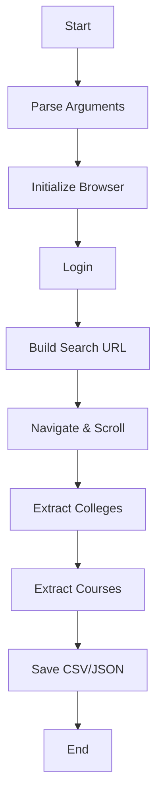

# College and Course data scraping service

<div align="center">


**Web scraping service built with Selenium to extract comprehensive college and course information from the CareerZoom platform.**
</div>

---

## Features

<table>
<tr>
<td width="50%">

### Core Capabilities
- **Flexible Filtering** - Filter by course category, specialization, city, and university
- **Batch Processing** - Execute multiple scraping tasks sequentially
- **Multiple Output Formats** - Export as CSV, JSON, or both
- **Course-Level Details** - Extract detailed information for all courses
<br/>
</td>
<td width="50%">

### Advanced Features
- **Automatic Login** - Supports both automatic and manual login modes
- **Duplicate Removal** - Automatically deduplicates college records
- **Progress Tracking** - Real-time progress updates and execution summaries
- **Error Handling** - Robust error handling with detailed logging
<br/>
</td>
</tr>
</table>

---

## Project Structure

```
backend/scraping-service/
│
├── src/
│   ├── __init__.py
│   ├── auth.py              # Authentication and browser setup
│   ├── config.py            # Configuration settings
│   ├── downloader.py        # Core scraping logic
│   └── utils.py             # Utility functions (CSV/JSON export, deduplication)
│
├── data/                    # Output directory (created automatically)
│   ├── *.csv               # CSV exports
│   ├── *.json              # JSON exports
│   └── batch_summary_*.txt # Batch execution reports
│
├── main.py                  # Single-task execution script
├── batch_runner.py          # Batch execution script
├── batch_config.py          # Batch task configuration
├── requirements.txt         # Python dependencies
└── README.md               # This file
```

---

## Installation

### Step 1: Clone the Repository

```bash
git clone <repository-url>
cd backend/scraping-service
```

### Step 2: Create a Virtual Environment (Recommended)

```bash
python -m venv venv

# On Windows
venv\Scripts\activate

# On macOS/Linux
source venv/bin/activate
```

### Step 3: Install Dependencies

```bash
pip install -r requirements.txt
```

---

## Configuration

### 1. Login Credentials

Update your credentials in `src/config.py` (already set):

```python
LOGIN_EMAIL = "your-email@example.com"
LOGIN_PASSWORD = "your-password"
```

### 2. Batch Configuration

Configure batch tasks in `batch_config.py`:

#### Option A: Python Dictionary (Default)

```python
BATCH_TASKS = [
    {
        "course_category": "Engineering",
        "specialization": None,
        "city": "Chandigarh",
        "university": None,
        "format": "json"
    },
    {
        "course_category": "Management",
        "specialization": "MBA",
        "city": "Bangalore",
        "university": None,
        "format": "both"
    },
]

BATCH_DELAY = 5  # Seconds between tasks
```

#### Option B: CSV File

Set `USE_CSV_CONFIG = True` in `batch_config.py` and create `batch_tasks.csv`:

```csv
course_category,specialization,city,university,format
Engineering,null,Chandigarh,null,json
Engineering,null,Bangalore,null,json
Management,MBA,Delhi,null,both
```

---

## Usage

### Single Task Mode

Execute a single scraping task with custom filters:

```bash
python main.py <course_category> <specialization> <city> <university> [--format csv|json|both]
```

#### Examples

```bash
# Engineering colleges in Chandigarh
python main.py Engineering null Chandigarh null --format json

# Chitkara University in Chandigarh
python main.py Engineering null Chandigarh Chitkara --format both

# All colleges in Bangalore
python main.py null null Bangalore null --format csv

# Manual login mode
python main.py Engineering null Delhi null --manual-login
```

#### Parameters

| Parameter | Description | Example |
|-----------|-------------|---------|
| `course_category` | Course category or "null" | Engineering, Management |
| `specialization` | Specialization or "null" | Science, Computer |
| `city` | City name or "null" | Chandigarh, Bangalore |
| `university` | University name or "null" | Chitkara, VIT |
| `--format` | Output format | csv, json, both |
| `--headless` | Run without GUI | - |
| `--manual-login` | Use manual login | - |

### Batch Mode

Execute multiple scraping tasks sequentially:

```bash
python batch_runner.py [--headless] [--manual-login]
```

#### Examples

```bash
# Normal execution (browser visible)
python batch_runner.py

# Headless mode (no browser window)
python batch_runner.py --headless

# Manual login (useful for CAPTCHA)
python batch_runner.py --manual-login
```

---

## Output Format

### JSON Format

```json
[
  {
    "College Name": "Chitkara University",
    "Location": "Chandigarh, Punjab",
    "Course Category": "Engineering",
    "Total Courses": "15",
    "College Type": "Private",
    "Match Percentage": "95%",
    "Match Level": "High Match",
    "Has Website Link": "Yes",
    "College ID": "12345",
    "Courses": [
      {
        "Course Name": "B.Tech Computer Science",
        "Fees": "2,50,000",
        "Duration": "4 Years",
        "Degree Type": "Bachelor Degree",
        "Entrance Exams": "JEE Main, CUET"
      }
    ]
  }
]
```

### CSV Format

Flattened structure with one row per college, courses in separate columns/rows.

### Batch Summary Report

Automatically generated after batch execution (`data/batch_summary_YYYYMMDD_HHMMSS.txt`):

```
======================================================================
BATCH EXECUTION SUMMARY
======================================================================
Execution Time: 2025-11-07 14:30:00

Overall Statistics:
  Total Tasks:        5
  Successful:         5
  Failed:             0
  Total Colleges:     127
  Total Courses:      845
  Total Duration:     325.50s (5.43 min)

Task Details:
----------------------------------------------------------------------

✅ Task 1: Success
   Category: Engineering, City: Chandigarh
   Colleges: 25, Courses: 178
   Duration: 65.30s
   Saved: data/Engineering_Chandigarh.json
```

---

## Workflow

### Single Task Workflow



---

## Troubleshooting

<details>
<summary><b>Login Failures</b></summary>

**Problem:** Automatic login fails or CAPTCHA appears

**Solution:**
```bash
# Use manual login mode
python main.py Engineering null Chandigarh null --manual-login
python batch_runner.py --manual-login
```
</details>

<details>
<summary><b>No Data Extracted</b></summary>

**Problem:** No colleges found for given filters

**Solution:**
- Verify filters are correct and colleges exist for those criteria
- Check if website structure has changed
- Try broader filters (use more "null" values)
- Check login session is valid
</details>

<details>
<summary><b>Memory Issues</b></summary>

**Problem:** System runs out of memory during long batch runs

**Solution:**
- Reduce `MAX_SCROLLS` in `config.py`
- Process tasks in smaller batches
- Close other applications
</details>

---

## Performance Tips

> **Tip 1:** Use batch mode for multiple tasks to reuse browser session  
> **Tip 2:** Adjust `BATCH_DELAY` based on server response time  
> **Tip 3:** JSON is faster than CSV for large datasets

---

## How It Works

### 1. Authentication (`auth.py`)
- Initializes Chrome browser with anti-detection measures
- Navigates to login page and handles iframe-based login form
- Supports both automatic and manual login modes

### 2. Data Extraction (`downloader.py`)
- **Progressive Scrolling**: Loads all colleges by scrolling to trigger lazy-loading
- **Course Iteration**: Extracts college information and iterates through all courses
- **Data Organization**: Structures data with courses nested under each college

### 3. Data Processing (`utils.py`)
- **Deduplication**: Removes duplicate colleges based on college name
- **Export**: Saves data in CSV and/or JSON format
- **Cleaning**: Normalizes text and removes extra whitespace

### 4. Batch Execution (`batch_runner.py`)
- Reuses single browser session for multiple tasks
- Maintains login state across tasks and generates comprehensive reports
